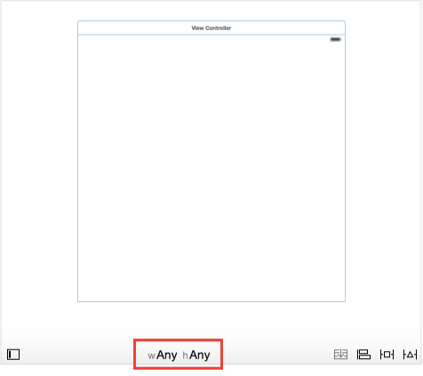
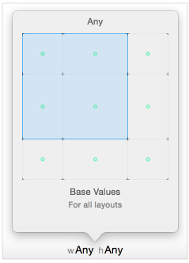
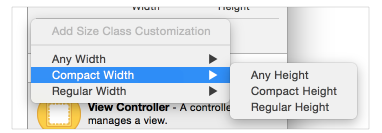
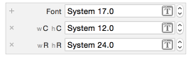

## Size-Class-Specific Layout

Interface Builder의 스토리 보드는 기본적으로 크기 클래스를 사용합니다. 크기 클래스는 장면이나 보기와 같은 사용자 인터페이스 요소에 지정된 특성입니다. 요소의 크기를 대략적으로 알려줍니다. Interface Builder를 사용하면 현재 크기 클래스를 기반으로 레이아웃의 많은 기능을 사용자 정의 할 수 있습니다. 그런 다음 레이아웃은 크기 클래스가 변경 될 때 자동으로 조정됩니다. 특히 크기별로 다음과 같은 기능을 설정할 수 있습니다.

- 보기 또는 컨트롤을 설치하거나 제거하십시오.
- 제한 조건을 설치 또는 제거하십시오.
- 선택 속성(ex, 글꼴 및 레이아웃 여백 설정)의 값을 설정합니다.

시스템은 장면을로드 할 때 모든 뷰, 컨트롤 및 제약 조건을 인스턴스화하고 이러한 항목을보기 컨트롤러의 해당 콘센트 (있는 경우)에 할당합니다. 장면의 현재 크기 클래스에 관계없이 콘센트를 통해 이러한 항복에 액세스 할 수 있습니다. 그러나 시스템은 현재 크기 클래스에 대해 설치된 경우에만 이러한 항목을보기 계층 구조에 추가합니다.

보기의 크기 클래스가 변경되면(ex, iPhone을 돌리거나 iPad응용 프로그램을 전체 화면과 분할 보기로 전화 할 때), 시스템은 자동으로 항목을보기 계층에 추가하거나 보기 계층에서 제거합니다. 뷰의 레이아웃에 대한 변경 사항도 애니메이션으로 표시됩니다.

>NOTE
>
> 시스템은 제거 된 항복에 대한 참조를 유지하므로 뷰 계층 구조에서 제거 될 때 할당이 취소되지 않습니다.

### Final and Base Size classes.

Interface Builder는 9 개의 서로 다른 크기 클래스를 인식합니다.

이들 중 4개는 최종 크기 클래스 인 Compact-Compact, Compact-Regular, Regular-Compact 및 Regular-Regular입니다. Final 클래스는 장치에 표시되는 실제 크기 클래스를 나타냅니다.

나머지 5개는 기본 크기 클래스 인 Compact-Any, Regular-Any, Any-Compact, Any-Regular 및 Any-Any입니다. 이것들은 2개 이상의 최종 사이즈 클래스를 나타내는 추상 사이즈 클래스입니다. 예를 들어, Compact-Any 크기 클래스에 설치된 항복은 Compact-Compact 및 Compact-Regular 크기보기에 나타냅니다.

보다 특정한 크기의 클래스에 설정된 것은 항상보다 일반적인 크기의 클래스보다 우선합니다. 또한 9개의 모든 크기 클래스 (기본 크기 클래스 포함)에 대해 모호하지 않고 만족스런 레이아웃을 제공해야합니다. 따라서 일반적으로 가장 일반적인 크기의 클래스에서 가장 구체적인 클래스로 작업하는 것이 가장 쉽습니다. 앱의 기본 레이아웃을 선택하고 Any-Any크기클래스에서 이 레이아웃을 다자인하십시오. 그런 다음 필요에 따라 다른 기본 또는 최종 크기 클래스를 수정하십시오.  

### Using the Size Class Tool

인터페이스 빌더의 크기 클래스 도구를 사용하여 현재 편집중인 크기 클래스를 선택하십시오. 이 도구는 편집기 창의 아래 가운데에 표시됩니다. 기본적으로 Interface Builder는 Any-Any 크기 클래스가 선택된 상태에서 시작됩니다.

새 크기 크래스로 전환하려면 크기 클래스 도구를 클릭합니다. Interface Builder는 크기 클래스의 3 x 3 격자를 포함하는 popover 뷰를 제공합니다. grid 위로 마우스를 이동하여 크기 클래스를 변경하십시오. grid는 선택된 크기 클래스의 이름을 상단에 표시하고 크기 크래스의 설명 (영향을 미치는 장치 및 방향 포함)을 하단에 표시합니다. 또한 현재 크기 클래스의 영향을 받는 각 크기 클래스에 녹색 점을 표시합니다.

캔버스에 추가 된 뷰 또는 제약 조건은 현재 크기 클래스에만 설치됩니다. 항목을 삭제할 때 동작은 항목이 삭제되는 위치와 벙법에 따라 다릅니다.

- canvas 또는 document outline에서 항목을 삭제하면 해당 항목이 프로젝트에서 완전히 제거됩니다.
- Command-Deleting 또는 document outline에서 항목을 삭제하면 현재 크기 클래스에서 항목만 제거됩니다.
- 장면에 둘 이상의 크기 클래스가 있는 경우 canvas 나 document outline 이외의 위치에서 항복을 삭제하면 (ex, 크기 속성에서 제약 조건을 선택하고 삭제하면) 현재 크기 클래스에서만 항목이 제거됩니다.
- Any-Any 크기 클래스 만 편집 한 경우 항목을 삭제하면 항상 프로젝트에서 제거됩니다.

Any-Any 크기 클래스가 아닌 다른 크기 클래스를 편집하는 경우 Interface Builder는 편집기 창의 아래쪽에 있는 툴바를 파란색으로 강조 표시합니다. 이렇게하면 보다 구체적인 크기 클래스에서 작업 할 때 명확 해집니다.

### Using the Inspectors

관리자의 크기 클래스 별 설정을 수정할 수도 있습니다. 크기 클래스 별 설정을 지원하는 항목은 속성 평에 작은 더하기 아이콘과 함께 나타납니다.

기본적으로 Inspector는 Any-Any 크기 클래스의 값을 설정합니다. 더 구체적인 크기 클래스에 대해 다른 값을 설정하려면 더하기 아이콘을 클릭하여 새 크기 클래스를 추가하십시오. 추가 할 크기 클래스의 너비와 높이를 선택하십시오.

Inspector는 이제 각 크기 클래스를 자체 줄에 표시합니다. Any-Any 설정이 맨 아래 줄이며 보다 구체적인 크기 클래스가 아래에 나와 있습니다. 다른 행과 독립적으로 각 행의 값을 편집 할 수 있습니다.

사용자 정의 크기 클래스를 제거하려면 행 시작 부분에있는 x 아이콘을 클릭하십시오.

Interface Builder에서 크기 클래스로 작업하는 방법에 대한 자세한 내용은 크기 클래스 디자인 도움말을 참조하십시오.
